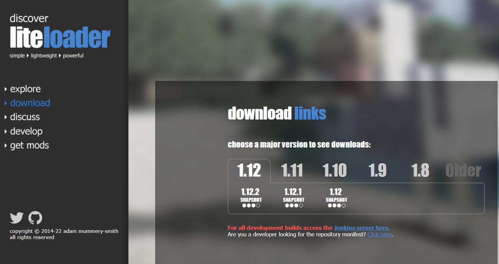

# Install Forge/Fabric/Liteloader


Using these method does not prevent the Forge installation from failing. You should [<mark style="background-color:red;">**Change download way**</mark>](../../basic-settings/download/download-settings.md#if-there-is-a-problem-with-the-download-heres-what-you-should-do) <mark style="background-color:red;">**in HMCLPE.**</mark>


## Mod loader installation using HMCL-PE

### Direct download and install using HMCL-PE

To install Mod loader using HMCL-PE, first you have to click on your game version in the main menu

By clicking on the MODLOADERS button, you can install Modloader and Optifine

### Installation via local files.

#### Forge:

1. The best way to download it is to go to the [**official website**](https://files.minecraftforge.net/net/minecraftforge/forge/) (although you need to wait for the ads)

.png>)

2.Find the sidebar and click on the version of Forge supported game you wish to download.

Then,click installer.

.png>)

3.Wait for the ads,and click  button.

.png>)

4.Then,The Forge will download automatically.

.png>)

5.Finally, you just need to go back to HMCLPE and click on the  button and find your browser download folder, locate the Forge-installer file and you will be taken to the installation screen.

#### Fabric

1. The best way to download it is to go to the [**official website**](https://fabricmc.net/)**.**

.png>)

2.Find "installation" section,click  Button

Find the version you need,then click  Button.

.png>)

3.Then,the installer will download automantically.

.png>)

4.Finally, you just need to go back to HMCLPE and click on the  button and find your browser download folder, locate the Fabric-installer file and you will be taken to the installation screen.

#### Fabric API

1. The best way to download it is to go to the [**official website**](https://fabricmc.net/)**.**

.png>)

2.Click .png>),It will jump to the Curseforge link in the release. You can also jump by clicking [**here**](https://www.curseforge.com/minecraft/mc-mods/fabric-api).

You can find all versions here, you just need to download the Fabric API for your minecraft version.

.png>)

Click this button,and you can view all releases

.png>)

You can filter the version you need by clicking here.

.png>)

3.Finally, you just need to **import** the Fabric API in the same way as **a mod**, and it will be loaded at game launch.

Don't know how to import a local module using HMCLPE? Click [**here.**](installing-mods.md)****

**Liteloader**

**1.**The best way to download it is to go to the [**official website**](http://www.liteloader.com/download)**.**

Switch to the download section.

Select the version you need to download.

**Press Download from Jenkins**

.png>)

2.Then,the installer will download automantically.

3.Finally, you just need to go back to HMCLPE and click on the  button and find your browser download folder, locate the Liteloader-installer file and you will be taken to the installation screen.
